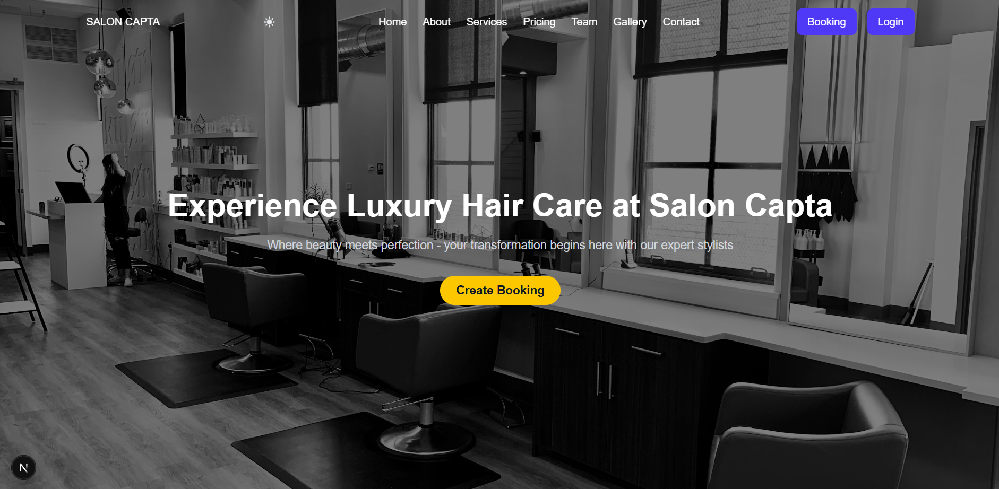

# Salon Capta

A modern, full-stack salon management system for appointment booking, POS transactions, employee management, and more.

## Features

- **Online Appointment Booking**: Schedule, view, and manage customer appointments.
- **POS System**: Create transactions with services and products, handle payments (cash/card), and manage inventory.
- **Employee Management**: Add, edit, and track employees, attendance, and salary reports.
- **Customer Management**: View and manage customer profiles and visit history.
- **Service & Product Catalog**: Manage salon services and retail products with categories and stock tracking.
- **Dashboard Overview**: Visual summary of appointments, revenue, and key business metrics.

## Tech Stack

- **Frontend**: Next.Js, TypeScript, TailwindCSS
- **Backend**: Spring Boot
- **Database**: PostgreSQL
- **API**: RESTful endpoints

## Getting Started

1. **Clone the repository**
2. **Install dependencies** for both client and server:
   - `cd client && npm install`
   - `cd ../server && mvn install`
3. **Configure environment variables** (DB connection, etc.)
4. **Run the backend**: `cd server && mvn spring-boot:run`
5. **Run the frontend**: `cd client && npm run dev`
6. Access the app at `http://localhost:3000`

## Folder Structure

- `client/` — Next.Js frontend
- `server/` — Spring Boot backend